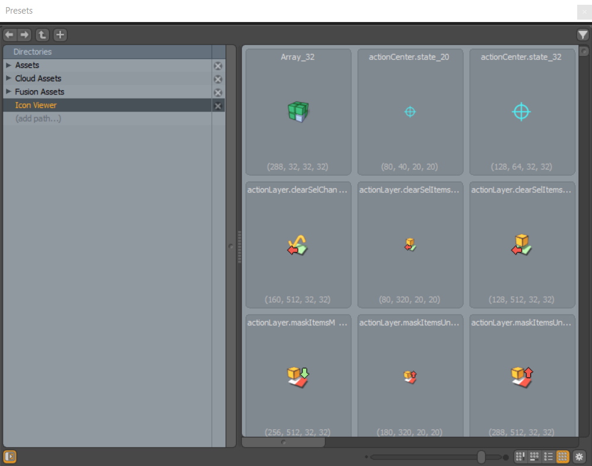

# Icon Viewer

Preset browser plugin that allow users to browse all available icons in Modo. Useful for setting icons in your custom forms. The full registered names for the icons will be used, as well as a caption with it's location and size to help debug. So to set an icon resource for your own custom forms you would want to remove any suffix like _32 from the entry.

The plugin will attempt to parse all configs to fetch icons and paths to image resources, so installing this kit will lead to a bit slower start up time.

## Installation

Download the .lpk from releases, this is a renamed zip that Modo should recognize - allowing you to drag-and-drop it into an active Modo session and Modo should unpack it into your kit path.

Or you could clone this project into your kit path.

Kit should work for Modo version 15 and above running Python3

## Contents

### index.cfg

Kit configuration, in the root of any kit you will find a similar file telling Modo which files to import and any settings.

### lxserv

This folder is read on start up and will include any Python plug-ins. All code for this project is found in `icon_viewer.py`

### index.xml

Used for packaging the kit as an lpk to distribute.
